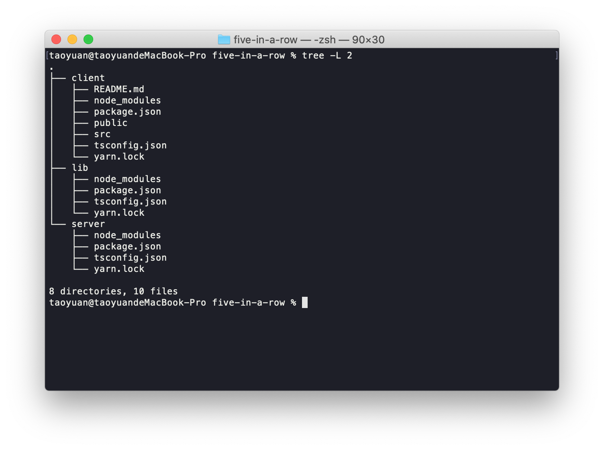

# 使用React与WebSocket来做一个多人对战的五子棋吧

 这不是教程。起因是我想用我的空闲时间做一个MMORPG的玩具，谁还没有一个实现自己游戏世界的梦想呢，我不是游戏从业者，所有有关游戏的知识都是从网上各种碎片化的信息而来的，所以想把制作过程用这种“直播”的方式发布到网上，那样如果有什么不好的，错误的认知会被指出来。

 而这个，就是一个前导片，来试验一下效果以及我是否能够坚持下来。

## 关于五子棋对战游戏

前端我使用`React`，后端实现一个`Koa`+`WebScoket`的服务器。
前后端都采用`TypeScript`， 为什么会用`TS`？ 社区有一堆用或不用的讨论，而我这里理由很简单， 就是：我喜欢呀。


## 项目搭建

游戏目录建立3个node package： 
* client 
* server
* lib

lib包预留，可能放一些前后端都用到的模块

1. 使用`create-react-app`创建`client`包
   ````base
   cd client
   yarn create react-app . --template=typescript
   ````
2. 初始化`server`与`lib`包
   ````bash
   cd server
   yarn init --yes
   yarn add -D typescript ts-node nodemon 
   npx tsc --init
   ````

目前目录结构看起来是这样的：


## Step1: 把前端UI搞出来，有个看得见的界面才踏实

修改create-react-app生成的App.tsx
````jsx
export default function App() {
  return (
    <div className="App">
      <BrowserRouter>
        <Switch>
          <Route path="/" exact component={Login} />
          <Route path="/lobby" component={Lobby} />
          <Route path="/battle" component={BattleField} />
        </Switch>
      </BrowserRouter>
    </div>
  );
}
````
三个页面分别是入口，大厅与对战房间。


### Login模块
身份验证我这里简单处理，由用户输入名字，服务器判断有效后返回一个token，之后client凭借name与token连接WebSocket Server。
不搞注册登陆这么复杂的一套。

`Login.tsx`
````jsx
export default function Login() {
    const [name, setName] = useState('');
    const ref = createRef<HTMLInputElement>();
    const [{ logged, loading, error }, doLogin] = Connect();
    const history = useHistory();
    useEffect(() => {
        if (logged) {
            history.push('/lobby');
        }
        ref.current?.focus();
    }, [history, logged, ref]);
    return (
        <div className="login">
            <form onSubmit={e => {
                e.preventDefault();
                doLogin(name);
            }}>
                <h3>FIVE IN A ROW</h3>
                <input
                    ref={ref}
                    placeholder="Enter your name"
                    value={name}
                    onChange={e => setName(e.target.value)}
                    disabled={loading}
                />
                <button type="submit" disabled={loading}>Login</button>
                <div className="err">{error}</div>
            </form>
        </div>
    )
}
````
登陆部分的逻辑放在Networking模块里，我将会在那初始化一个WebSocket连接

Networking.ts
````jsx
type State = {
    loading: boolean,
    error: string,
    logged: boolean,
    name: string,
    token: string,
}

const Connect = (): [State, React.Dispatch<string>] => {
    const [loading, setLoading] = useState(false);
    const [error, setError] = useState('');
    const [logged, setLogged] = useState(false);
    const [name, setName] = useState('');
    const [token, setToken] = useState('');
    useEffect(() => {
        const request = async () => {
            setError('');
            setLoading(true);
            const res = await fetch('/api/login', {
                body: JSON.stringify({ name }),
                method: 'POST',
                headers: {
                    'Content-Type': 'application/json'
                }
            });
            setLoading(false);

            if (res.status === 200) {
                const { token } = await res.json();
                setToken(token);
                setLogged(true);
            } else {
                const errmsg = await res.text();
                setError(errmsg);
            }

        }
        if (name && !logged) {
            request();
        }
    }, [name, logged]);
    return [{ loading, error, logged, name, token }, setName];
}

export { Connect }
````

事实上我用React Hooks实现这种`click and send request`这种需求总是感觉到很别扭，也许是打开方式不对，也许是理解有误？ useEffect压根不是用来解决这种问题的？ 如果有高人看到这篇文章还请解惑。

那么现在看起来是这个样子的:


有了个不错的开始，是时候写一点后端部分的代码了。

## Step2 服务端的第一次

后台没有脚手架工具帮忙自动配置好，首先需要做一点点准备工作。

1. 修改`package.json`:
   ````json
   "scripts": {
      "start": "nodemon src/index.ts"
   },
   "nodemonConfig": {
     "watch": ["src"],
     "events": {
        "start": "node -e 'console.clear()'"
      }
   }
   ````
   使用nodemon启动项目，监视src文件夹。

2. 修改`tsconfig.json`
   ````json
    "moduleResolution": "node",
    "target": "ES2015", 
    "module": "commonjs", 
    "lib": ["ES2015"], 
    "outDir": "./lib", 
    "rootDir": "./src",
   ````
3. 安装必要的依赖
   ````bash
   yarn add koa koa-route ws koa-bodyparser 
   ````

   PS：我安装依赖的时候喜欢加上`-E`，这些npm上的库变化太快，有时候隔段时间升了个小版本原来的用法就不对了。

开始写代码吧，先把登陆功能完成。
`index.ts`
````jsx
import Koa from 'koa';
import bodyParser from 'koa-bodyparser';
import routes from 'koa-route';
import GameServer from './game-server';
import tokenUtil from './token';
const gameServer = new GameServer();
const app = new Koa();
app.use(bodyParser());
app.use(routes.post('/api/login', ctx => {
    const name: string = ctx.request.body.name || '';
    if (!/^[a-zA-Z\u4E00-\u9FA5][a-zA-Z0-9\u4E00-\u9FA5_-]{3,8}$/.test(name)) {
        ctx.status = 406;
        ctx.body = 'Invalid player name supplied.';
        return;
    }
    if (gameServer.isPlayerExists(name)) {
        ctx.status = 409;
        ctx.body = `${name} already exists.`;
        return;
    }
    ctx.body = { token: tokenUtil.create(name) };
}));

const PORT = process.env.PORT || 5000;
const httpServer = app.listen(PORT, () => {
    console.log(`Server started on port ${PORT}.`);
})
````
前面说过的，用一个简单的token意思一下。

token.ts
````ts
import crypto from 'crypto';
const SECRET = 'puppy and kitten';
export default {
    create(name: string) {
        return crypto.createHash('sha256').update(name + SECRET).digest('base64');
    },

    check(name: string, token: string) {
        return this.create(name) === token;
    }
}
````

GameServer目前是空白的，我慢慢来填充。
````ts
export default class GameServer {
    initialize(httpServer: Server) {

    }

    isPlayerExists(name: string) {
        return true;
    }
}
````

initialize方法中利用koa的HttpServer创建WebSocketServer，由于身份验证的方式没有使用session，那么能在握手阶段进行验证的方式只有两种了url带参数和使用Sec-WesbSocket-Protocl传参，我选择第二种。

````ts
initialize(httpServer: Server) {
    const wss = new WebSocket.Server({ noServer: true });
    httpServer.on('upgrade', async (req: IncomingMessage, socket: Socket, head: Buffer) => {
        try {
            const conn = await this.acceptConnection(wss, req, socket, head);
            this.addConnection(conn);
        } catch (_) {
            console.error(_);
        }
    })
}

acceptConnection(wss: WebSocket.Server, req: IncomingMessage, socket: Socket, head: Buffer) {
    return new Promise<Connection>((resolve, reject) => {
        const [name, authenticated] = this.authenticate(req);
        if (authenticated) {
            wss.handleUpgrade(req, socket, head, ws => {
                const conn = new Connection(ws, name);
                resolve(conn);
            });
            if (socket.destroyed) {
                reject('Handshake failed.')
            }
        } else {
            socket.write('HTTP/1.1 401\r\n');
            socket.destroy();
            reject('Unauthorized.');
        }
    });
}

authenticate(req: IncomingMessage):[string, boolean] {
   const userInfo = (req.headers['sec-websocket-protocol'] as string) ?? '';
   const [name, token] = userInfo.split(', ');
   return [name, tokenUtil.check(decodeURIComponent(name), decodeURIComponent(token))];
}
````

利用协议传参数需要进行URL编码转换，否则浏览器会报错。改一下client代码来试试。

Networking.ts 添加：
````ts
const connection = new Connection();
````

修改一下原来登陆的代码
````jsx
if (res.status === 200) {
   const { token } = await res.json();
 + connection.name = name;
 + connection.token = token;
 + connection.connect();
   setToken(token);
   setLogged(true);
} 
````

Connection.ts
````ts
export default class Connection extends EventEmitter {
    name?: string;
    token?: string;
    ws?: WebSocket;
    readyState = -1;
    connect(url = 'ws://localhost:5000') {
        if (!this.name || !this.token)
            return;
        const ws = this.ws = new WebSocket(url, [encodeURIComponent(this.name), encodeURIComponent(this.token)]);
        this.ws.onopen = () => {
            this.readyState = ws.readyState;
            this.emit('open');
            console.log('connected to server.')
        }
        this.ws.onclose = (e) => {
            this.readyState = ws.readyState;
            this.emit('close', e.code, e.reason);
        }
        this.ws.onerror = () => {
            this.emit('error');
            this.readyState = ws.readyState;
        }
    }
}
````

看起来没问题了，接下来继续服务端的工作。

game-server.ts

````ts
let uniqueId = 100;
export default class GameServer {
    connections: Connection[] = [];

    addConnection(conn: Connection) {
        conn.id = uniqueId++;
        conn.on('close', id => {
            this.removeConnection(id);
        })
        this.connections.push(conn);
    }

    removeConnection(id: number) {
        for(let i=this.connections.length-1; i>-1; i--) {
            let conn = this.connections[i];
            if (conn.id === id) {
                conn.destory();
                this.connections.splice(i, 1);
                break;
            }
        }
    }

    isPlayerExists(name: string) {
        return this.connections.find(c => c.name === name);
    }
}
````
我需要把连接保存起来，在连接被关闭之后能够删它， isPlayerExists方法顺带也就完成了，接下来是Connection类（Server side)

````ts
export default class Connection extends EventEmitter {
    on!: (event: 'close', listener: (this: Connection, id: number) => void) => this;

    id: number = 0;
    isClosed = false;
    constructor(public socket: WebSocket, public name: string) {
        super();
        socket.on('close', () => this.close());
    }

    close() {
        this.isClosed = true;
        this.emit('close', this.id);
    }

    // close socket && clean it up
    destory(code?: number) {
        this.socket.removeAllListeners();
        this.socket.close(code);
        this.removeAllListeners();
    }
}
````

destory方法把一切清理干净，这里的close方法并不会主动关闭socket连接，只是发出事件由GameServer统一管理。

接下来要考虑怎么处理数据交互了，考虑到玩家在大厅里与在对战房间里是完全不同的行为，那么为不同的行为使用不同的处理模块会是一个不错的方式，
给Connection类增加一个Processor对象用来处理不同状态的交互。处理器对象有Enter， Leave， Hungup方法，比如大厅处理器的Enter方法里面可以发送当前开放房间的列表给client，离开方法里可以广播给大厅用户更新列表。

定义 Processor
````ts
export abstract class Processor {
    abstract handle(message:any):void;
    abstract enter(): void;
    abstract leave(): void;
    abstract hungup(): void;
}
````

修改Connection类
````ts
close() {
    ...
    this.processor.hungup();
}

_processor!: Processor;

get processor() {
    return this._processor;
}

set processor(current: Processor) {
    if (this._processor) {
        this._processor.leave();
    }
    this._processor = current;
    current.enter();
}
````
GameServer创建Connection时给一个初始processor
````ts
addConnection(conn: Connection) {
    conn.id = uniqueId++;
    conn.processor = new LobbyProcessor(conn, this);
    conn.on('close', id => {
        this.removeConnection(id);
    })
    this.connections.push(conn);
}
````

LobbyProcess
````ts
export default class LobbyProcessor extends Processor {
    constructor(public conn: Connection, public gs: GameServer) {
        super()
    }
    enter() {
        console.log(`Player ${this.conn.name} joined. num of players:${this.gs.connections.length}`);
    }

    handle(message:any) {}

    leave() {}

    hungup() {
        console.log(`Player ${this.conn.name} left.`)
    }
}
````

看一下效果


玩家进入大厅，大厅处理器首先要做的事是把当前大厅房间列表发送给玩家。 为此，服务端需要创建一个Player对象处理游戏相关的信息，如果把这些通通都绑定在Connection对象上无疑是很憨的。

创建一个Lobby类，用来管理游戏大厅，LobbyProcessor传入的对象就不再是GameServer了，GameServer专注管理网络连接的创建与删除。

````ts
export default class Player extends EventEmitter {
    roomId: number = 0;
    id: number;
    name: string;
    constructor(public connection: Connection) {
        super();
        this.id = connection.id;
        this.name = connection.name;
    }
}
````

GameServer.ts
````ts
lobby: Lobby = new Lobby();
addConnection(conn: Connection) {
    ....
    conn.processor = new LobbyProcessor(conn, this.lobby);
}
````

Lobby.ts
````ts
export default class Lobby {
    players: Player[] = [];

    get numOfPlayers() {
        return this.players.length;
    }

    addPlayer(player: Player) {
        this.players.push(player);
    }

    removePlayer(player: Player) {
        for (let i = this.players.length - 1; i > -1; i--) {
            if (player.id === this.players[i].id) {
                this.players.splice(i, 1);
                break;
            }
        }
    }
}
````

大厅处理器创建一个Player对象，向大厅添加Player，并且广播给大厅所有用户

````ts
export default class LobbyProcessor extends Processor {
    player: Player;
    constructor(public conn: Connection, public lobby: Lobby) {
        super();
        this.player = new Player(conn);
    }
    enter() {
        this.lobby.addPlayer(this.player);
        this.lobby.boardcast(`Player ${this.player.name} joined.`, this.player.id);
        console.log(`Player ${this.player.name} joined. num of players:${this.lobby.numOfPlayers}`);
    }

    leave() {

    }

    hungup() {
        this.lobby.removePlayer(this.player);
        console.log(`Player ${this.player.name} left.`);
    }
}
````

来实现Lobby.boardcast
````ts
boardcast(message: any, ignoreId?: number) {
    this.players.forEach(player => {
        if (player.id !== ignoreId) {
            player.connection.send(message);
        }
    })
}
````

Connection.ts
````ts
send(message: any) {
    this.socket.send(JSON.stringify(message));
}
````

## Step3 消息结构的处理

到目前为止，实现了一个Http服务器与WebSocket服务器，他们的身份验证系统相关联，WebSocket服务器实现了连接管理器，以及一套管理连接交互的方式（Processor），是时候考虑考虑消息结构的问题了，前面的代码只是简单的广播了一个文本字符串，这对于实时网络应用是远远不够的，我们需要约定一套消息结构，服务端与客户端遵循规定来序列化/反序列化消息包。

这方面的解决方案有很多，如ProtoBuf，msgpack，这里我用Javascript Runtime原生的JSON，为了充分利用typescript的类型检查与智能提示，需要做一点小小的辅助工作。

基本思路是这样的，利用typescript interface 声明消息包结构，然后解析声明文件自动生成用于序列化，反序列化的ts代码。之前创建的lib包终于派上用场了，消息包的序列化与反序列化是客户端/服务端都用得上的功能。
在lib内我会创建一个Protocol类，用它来对消息进行处理。之后client与server都引用这个包。

PS: lib 包内完成内容之后需要tsc build很不方便，貌似如果使用 [Project References](https://www.typescriptlang.org/docs/handbook/project-references.html)就能很好解决这个痛点，但是我试了下好像ts-node并不能很好的支持。是我的打开方式不对吗？ 期待有人能告诉我更好的解决方案。

建立一个packet.ts用来定义消息结构
````ts
export enum Types {
    ROOM_LIST = 1
}

type Room = {
    id: number,
    members: number[]
}

export interface HELLO_WORLD {
    action: Types.ROOM_LIST,
    rooms: Room[]
}
````

我期望能用下面的形式使用：
````jsx
const msg = Protocol.CREATE_HELLO_WORLD(roomList);
// msg = {action:1, rooms:roomList}
let message = Protocol.decode(jsonString); 
// message的类型为Message
// 这样就能利用TypeScript的感知功能当message.action=1时，得到HELLO_WORLD对应的智能提示了。
`````

PS: decode方法内甚至可以加入包的合法性检查，检查每一个字段的值是否符合，这样稍显复杂了，我暂且不做。

`typescript`编译器可以根据ts文件生成AST，这让事情变得简单了，只需要拿到消息包的每一个字段，然后使用对应的类型写入方法即可。

创建`generater.js` (方便起见，生成器就不用ts了)
````js
const fs = require('fs');
const ts = require('typescript');
const spawn = require('cross-spawn');
console.clear();
const args = process.argv.splice(2);
const source = args[0] || 'proto.ts';
const dest = args[3] || 'protocol.ts';

if (!fs.existsSync(source)) {
    console.error('Source declaration file does not exists');
    process.exit(0);
}

const program = ts.createProgram([source], {
    target: ts.ScriptTarget.Latest
});
const checker = program.getTypeChecker();
const sourceFile = program.getSourceFile(source);

let packets = [];
const creates = [];
ts.forEachChild(sourceFile, n => {
    if (ts.isInterfaceDeclaration(n)) {
        const symbol = checker.getSymbolAtLocation(n.name);
        const packetName = symbol.getName();
        let fn_args = [];
        let members = [];
        symbol.members.forEach(member => {
            const type = checker.getTypeOfSymbolAtLocation(member, member.valueDeclaration);
            const memberName = member.getName();
            if (!type.isLiteral()) {
                members.push(memberName)
                fn_args.push(`${memberName}:${checker.typeToString(type)}`)
            } else {
                members.push(`${memberName}:${type.value}`);
            }
        });
        const template = `export function CREATE_${packetName}(${fn_args.join(',')}): ${packetName} {
            return {${members.join(',')}}}`;
        creates.push(template);
        packets.push(packetName);
    }
});

let sourceContent = fs.readFileSync(source).toString();
const exportAllMessage = `export type Message = ` + packets.join(' | ') + ';';
sourceContent += '\r\n' + exportAllMessage + '\r\n';

sourceContent += creates.join('\r\n');
sourceContent += `\r\nexport function decode(raw: string): Message | undefined {
    let obj = undefined;
    try {
        obj = JSON.parse(raw);
    } catch (_) {
        return undefined;
    }
    if (!obj || !('action' in obj)) return undefined;
    return obj as Message;
}
`
fs.writeFileSync(dest, sourceContent);

const child = spawn('npx', ['tsc', '-d', 'protocol.ts'], { stdio: 'inherit' });
child.on('close', code => {
    if (code !== 0) {
        console.error('creation failed.')
    }
    console.log('done');
});

````

接下来要去server试一下发包了(server项目引用lib需要`npm link`或者使用`yarn workspace`)

首先把相关的方法参数类型加上。
````ts
import { Message } from 'lib/protocol';

//Connection.ts
send(message: Message) 

//Lobby.ts
 boardcast(message: Message, ignoreId?: number) 
````

修改LobbyProcessor.enter,用户进入大厅后向其发送大厅房间列表
````jsx
 enter() {
    this.lobby.addPlayer(this.player);
    console.log(`Player ${this.player.name} joined. num of players:${this.lobby.numOfPlayers}`);
    this.conn.send(CREATE_ROOM_LIST(this.lobby.serializeRoomList()));
}
````
serializeRoomList就是把当前房间列表变为Protocol里面定义的格式。
````ts
rooms: Room[] = [];
serializeRoomList() {
    return this.rooms.map(room => room.serialize())
}
`````

新增加Room.ts，慢慢给他填充功能。

````ts
import Player from "./Player";
let uniqueId = 100;
export default class Room {
    id: number;
    members: Player[] = [];
    constructor() {
        this.id = uniqueId++;
    }

    serialize() {
        return {
            id: this.id,
            members: this.members.map(p => p.id)
        }
    }
}
````

## Step4 创建房间

现在客户端连接已经可以接收到房间列表了。接下来要做的是创建一个房间。

创建房间的消息很简单，就一个action。
把Connection类的接收方法补上
````ts
constructor() {
    ....
    socket.on('message', data => this.receiveData(data));
}

receiveData(data: WebSocket.Data) {
    const message = decode(data as string);
    message && this.processor.handle(message);
}
````

如果收到CREATE_ROOM包，通知大厅创建房间，当前玩家作为主人进入房间，并且把连接处理器改成RoomProcessor

LobbyProcessor.ts
````ts
handle(message: Message) {
    switch (message.action) {
        case Types.CREATE_ROOM:
            const room = this.lobby.createRoom(this.player);
            this.player.enterRoom(room);
            this.conn.processor = new RoomProcessor(this.conn, this.lobby, this.player);
            break;
    }
}
````

Lobby.createRoom
````ts
createRoom(host: Player) {
    const room = new Room();
    room.host = host;
    this.rooms.push(room);
    this.boardcast(CREATE_ROOM_LIST(this.serializeRoomList()), host.id);
    return room;
}
````

Player.ts
````ts
enterRoom(room: Room) {
    this.roomId = room.id;
    room.members.push(this);
}

leaveRoom(room: Room) {
    this.roomId = 0;
    room.removePlayer(this);
}
````

RoomProcessor中，enter方法发送给玩家进入房间的消息，hungup方法 在玩家退出之后做一些清理工作。
````ts
enter() {
    const room = this.lobby.findRoom(this.player.roomId);
    room && this.conn.send(CREATE_ENTER_ROOM(room.id, room.host === this.player));
}

hungup() {
    this.lobby.removePlayer(this.player);
    if (this.player.roomId) {
        const room = this.lobby.findRoom(this.player.roomId);
        if (room) {
            this.player.leaveRoom(room);
            this.lobby.removeOfResetRoom(room);
        }
    }
    console.log(`Player ${this.player.name} left.`);
}
````

在玩家退出房间后，如果房间没有其他人了就删房间，如果房间主人不在了那么顺位继承大统。
Lobby.ts
````ts
removeRoom(id: number) {
    for (let i = this.rooms.length - 1; i > -1; i--) {
        if (this.rooms[i].id === id) {
            this.rooms.splice(i, 1);
            break;
        }
    }
    this.boardcast(CREATE_ROOM_LIST(this.serializeRoomList()));
}

transferRoom(room: Room) {

}

removeOfResetRoom(room: Room) {
    if (room.members.length === 0) {
        this.removeRoom(room.id);
    } else if (!room.host) {
        this.transferRoom(room);
    }
}
````

前端需要做一点工作来现实房间列表和发送创建房间命令

Connection.ts
````ts
connect() {
    ...
    this.ws.onopen = () => {
        this.readyState = ws.readyState;
        this.emit('connect');
    }

    this.ws.onmessage = (e) => {
        const message = decode(e.data);
        message && this.onMessage(message);
    }
}

onMessage(message: Message) {
    switch (message.action) {
        case Types.ROOM_LIST:
            this.emit('roomList', message.rooms);
            break;
        case Types.ENTER_ROOM:
            this.emit('enterRoom', message.roomId, message.isHost);
            break;
    }
}

send(message: Message) {
        this.ws?.send(JSON.stringify(message));
    }

createRoom() {
    this.send(CREATE_CREATE_ROOM());
}

enterRoom(id: number) {
    //
}
````

Lobby.tsx

````tsx
export default function Lobby() {
    const history = useHistory();
    const [roomList, setRoomList] = useState<Room[]>([]);
    const [connected, setConnected] = useState(false);
    useEffect(() => {
        connection.on('connect', () => {
            setConnected(true);
        });
        connection.on('roomList', (rooms: Room[]) => {
            setRoomList(rooms);
        });
        connection.on('enterRoom', (roomId: number, isHost: boolean) => {
            history.push('/battle')
        });
        if (!connection.token) {
            history.push('/');

        } else {
            connection.connect();
        }
        return () => {
            connection.removeAllListeners();
        }
    }, [history])
    return (
        <div className="lobby">
            {
                roomList.map(room =>
                    (
                        <RoomCompoent
                            key={room.id}
                            {...room}
                            onClick={roomId => connection.enterRoom(roomId)}
                        />
                    )
                )
            }
            <button className="newRoom" disabled={!connected} onClick={() => connection.createRoom()}>NEW</button>
        </div>
    )
}
````

connect的调用放到这里来，在连接成功之前，NEW按钮不可点击

Room.tsx
````ts
export default (props: RoomProps) => {
    const { id, members } = props;
    let className = 'room';
    if (members.length > 1)
        className += ' busy';

    const onClick = () => {
        (members.length === 1) && props.onClick(id);
    }
    return (
        <div className={className} onClick={onClick}>
            {members.map((m, i) => {
                const cls = i === 0 ? 'member' : 'member sec';
                return <div key={i} className={cls}></div>
            })}
            <div className="roomId">{id}</div>
        </div>
    )
}
````

Room组件很简单，就是展示房间号以及房间内的玩家。我用两个圈圈表示。看一下现在的效果：

